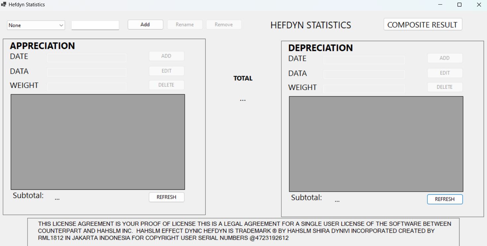

# HefdynStatistics

HefdynStatistics is a powerful tool designed to help you manage and analyze statistical data efficiently. With its user-friendly interface and robust features, you can easily perform complex statistical analyses, generate reports, and visualize data.

## Features

- Comprehensive statistical analysis tools
- User-friendly interface
- Data visualization and reporting

## Installation Guide

Follow these steps to install HefdynStatistics on your computer:

1. **Download the Installer**:
   - Go to the [Releases](https://github.com/RML1812/HefdynStatistics/tree/master/releases) page.
   - Download the latest release zip file (`HefdynStatistics-1.0.0.0-Installer.zip`).

2. **Extract the ZIP File**:
   - Extract the contents of the downloaded zip file.

3. **Run the Setup**:
   - Navigate to the extracted folder.
   - Run `Setup.exe`.

4. **Follow the Setup Instructions**:
   - Follow the on-screen instructions to complete the installation.

## Documentation

Below is a placeholder for a screenshot of the application:

## Usage

1. After installation, launch `HefdynStatistics` from the Start menu or desktop shortcut.
2. Use the various tools and features to perform your statistical analysis.
3. Generate reports and visualize your data using the built-in visualization tools.
